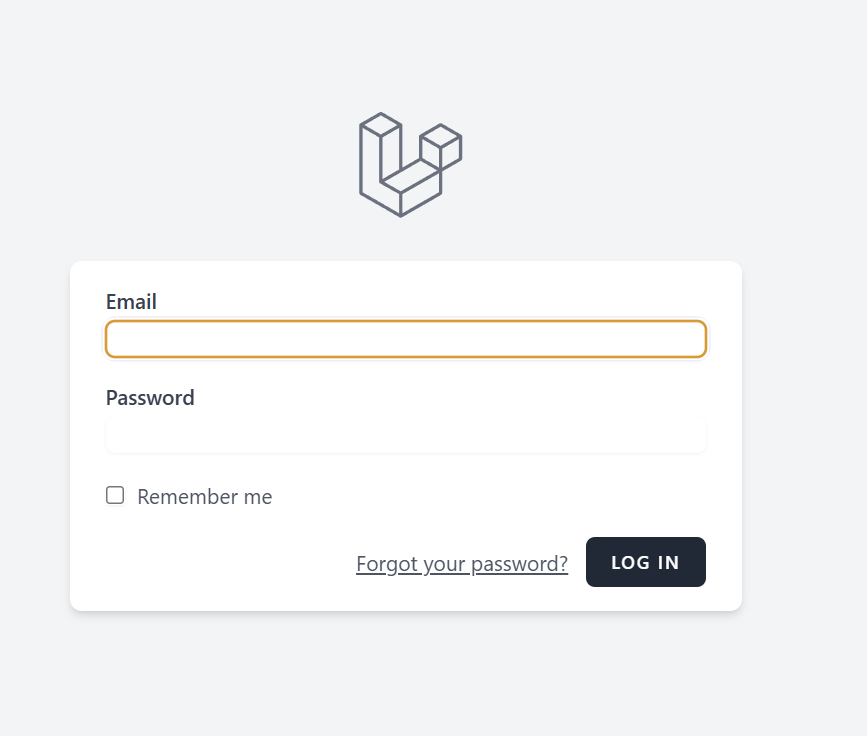
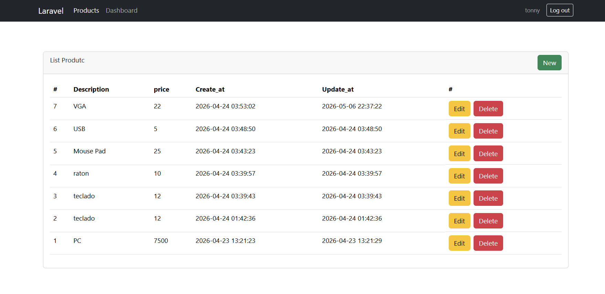
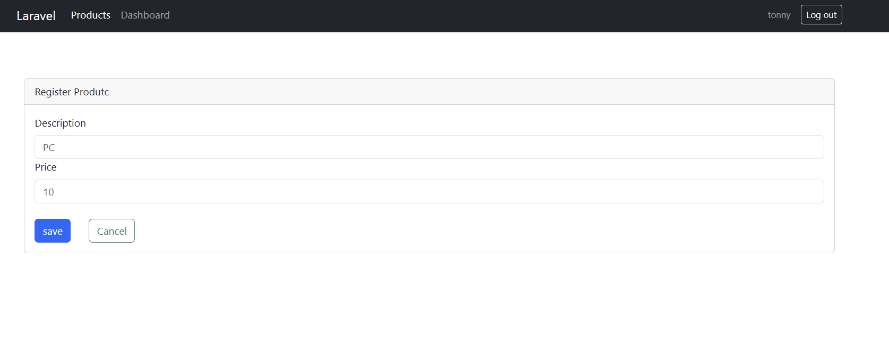

# Proyecto PHP Laravel - Practical Projects

Este es un proyecto desarrollado con el framework **Laravel**, enfocado en la implementación de soluciones prácticas y modernas. Utiliza un stack robusto que combina potencia en el backend y reactividad ligera en el frontend.

## 🛠️ Stack Tecnológico

- **Framework:** [Laravel](https://laravel.com/)
- **Frontend:** [Alpine.js v3.15](https://alpinejs.dev/) para una reactividad sencilla y eficiente sin la sobrecarga de frameworks más pesados.
- **Gestión de Fechas:** [Carbon](https://carbon.nesbot.com/) para la manipulación avanzada de tiempos y fechas.
- **Generación de Datos:** [FakerPHP](https://fakerphp.github.io/), configurado con proveedores localizados para múltiples regiones:
  - España (`es_ES`)
  - Argentina (`es_AR`)
  - Venezuela (`es_VE`)
  - Italia (`it_IT`)
  - Filipinas (`en_PH`)
- **Debugging:** Ignition como página de error detallada y herramientas de depuración mejoradas.

## 🚀 Instalación y Configuración

Sigue estos pasos para configurar el proyecto en tu entorno local:

1.  **Clonar el repositorio:**
    ```bash
    git clone <url-del-repositorio>
    cd php-laravel
    ```

2.  **Instalar dependencias de PHP:**
    ```bash
    composer install
    ```

3.  **Instalar dependencias de Frontend:**
    ```bash
    npm install
    ```

4.  **Configurar el entorno:**
    Copia el archivo `.env.example` a `.env` y configura tus credenciales de base de datos.
    ```bash
    cp .env.example .env
    php artisan key:generate
    ```

5.  **Migraciones y Datos de Prueba:**
    El proyecto incluye seeders que aprovechan la potencia de Faker para generar información realista.
    ```bash
    php artisan migrate --seed
    ```

6.  **Ejecutar el proyecto:**
    ```bash
    php artisan serve
    ```

## 📄 Licencia

Este proyecto está bajo la licencia MIT.

## ANEXOS
 "login"

